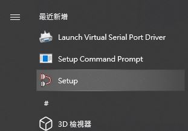
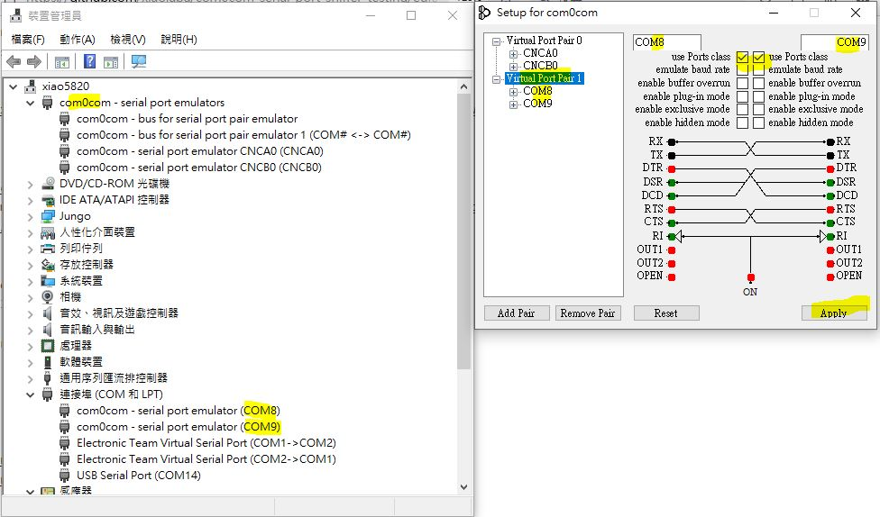
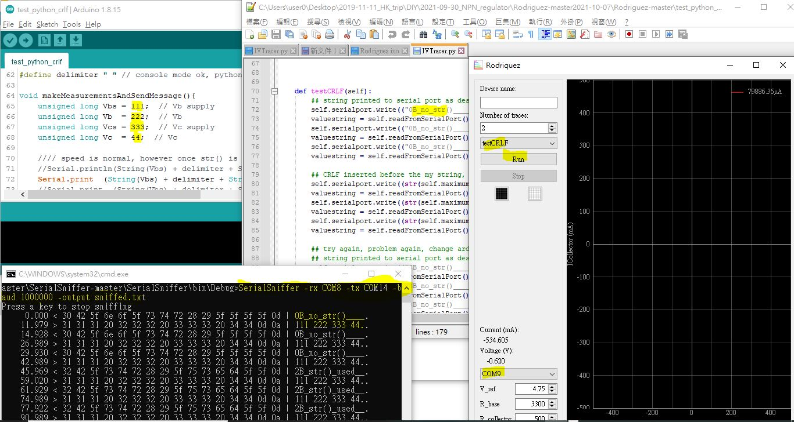

# com0com-serial-port-sniffer-testing
serial port / UART sniffer, not only logger

### initiation  
https://github.com/xiaolaba/Curve_Tracer_testing/blob/main/README.md#crlf-redundant-whether-the-logger-fault-


### used virtual com port driver win10 64bit, works
reading,  
http://com0com.sourceforge.net/  
open source, com0com-3.0.0.0-i386-and-x64-signed.zip, https://sourceforge.net/projects/com0com/files/latest/download  
commercial,  https://www.virtual-serial-port.org/  


### testing and code
1. install com0com-3.0.0.0-i386-and-x64-signed.zip
2. setup com0com0   
3. create a pair virtual com8 and com9, uses port Class only   
4. SerialSniffer, build this C# software by visual studio, https://github.com/xiaolaba/SerialSniffer
5. check arduino connect comport, mine is com14, edit the a.bat with this com14
6. burn the arduino code test_python_crlf.ino
7. build hostware, select com9, this is a version of source code and devirved from https://github.com/xiaolaba/Curve_Tracer_testing/  
8. goto SerialSniffer & exe build folder, mine is SerialSniffer-master\SerialSniffer\bin\Debug  
9. creat a.bat in exe build folder, or input with your command prompt ```SerialSniffer -rx COM8 -tx COM14 -baud 1000000 -output sniffed.txt ```
10. run a.bat, will open SerialSniffer 
11. goto folder test_python_crlf, run_py.bat, will open hostware for testing  
12. look at the serial port and screen output, something like this   
13. job done, Serialsniffer is working flawnessly


reading, reference,  
https://moon-half.info/p/3491  
https://cloud.tencent.com/developer/article/1030914  

did not work
http://www.sudt.com/cn/stax/download.htm


